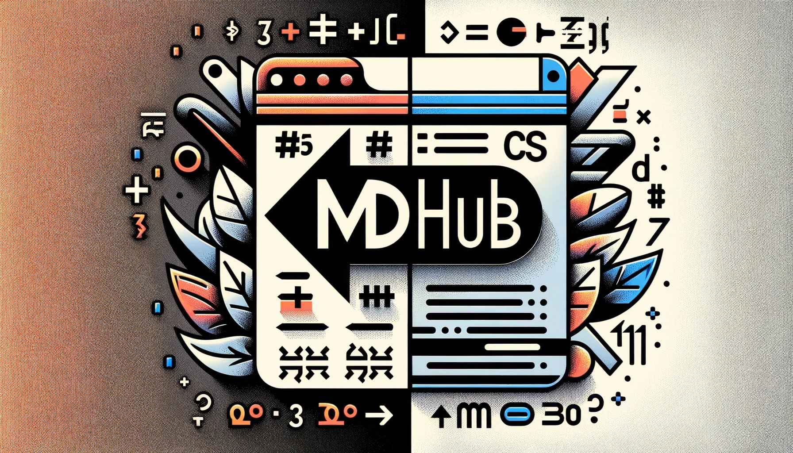

# MDHub



 

Easily convert Markdown files to styled HTML. Perfect for delivering projects to clients who might not be familiar with `.md` files.

## Table of Contents
- [MDHub](#mdhub)
  - [Table of Contents](#table-of-contents)
  - [Why MD2HTML?](#why-md2html)
    - [The name](#the-name)
  - [Features](#features)
  - [Installation](#installation)
  - [Usage](#usage)
  - [My links](#my-links)

## Why MD2HTML?

Sometimes when delivering projects to clients, they might not be familiar with Markdown or might not have the necessary tools to render it. Online converters often don't replicate the GitHub styling, and might not support dark/light modes. `MD2HTML` fills this gap by providing a simple tool to convert Markdown files to styled HTML that resembles GitHub's own rendering, with support for both dark and light themes.

### The name
The name "mdhub" is a nod to the central theme of our tool – making your Markdown files look and feel like they're on GitHub. "md" stands for Markdown, and "hub" alludes to a central place or repository, reminiscent of GitHub where a lot of Markdown content is commonly hosted and viewed. Our goal is to bring that familiar and stylish GitHub appearance to your Markdown files, no matter where they're viewed from, hence the name "mdhub".

## Features

- Converts `.md` files to `.html` with GitHub-like styling.
- Supports both dark and light modes.
- Simple CLI interface for easy use.

## Installation

You can easily install `MDHUB` using pip:

```bash
pip3 install mdhub
```

## Usage
Run the tool using the following command:
```bash
mdhub <inputfile.md (default is README.md)> <optional output file name (default is README.html)> <light or dark mode (default is dark)>
```

For example, to convert `sample.md` to `output.html` in dark mode:
```bash
mdhub sample.md output.html
```

Or to convert `README.md` to `README.html` in dark mode (using default values):
```bash
mdhub
```

## My links

- [Medium Article](https://medium.com/@glizzykingdreko/ad-blockers-are-allowed-on-youtube-40a040a2d039?postPublishedType=initial)
- [Website](https://glizzykingdreko.github.io/)
- [GitHub](https://github.com/glizzykingdreko)
- [Twitter](https://mobile.twitter.com/glizzykingdreko)
- [Medium](https://medium.com/@glizzykingdreko)
- [Email](mailto:glizzykingdreko@protonmail.com)